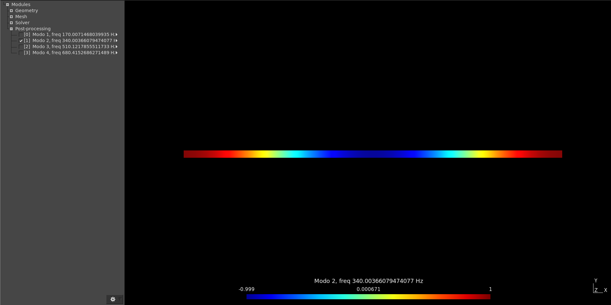
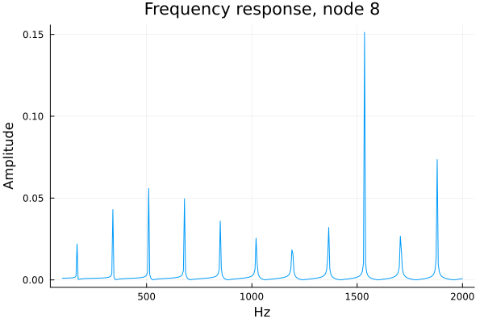
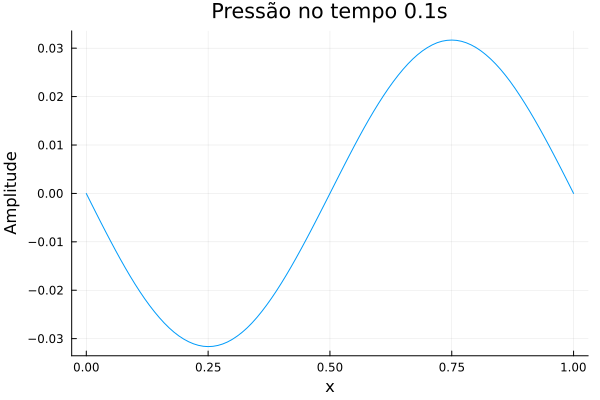

# LSound
Código acadêmico para a simulação de problemas de acústica linear 2D e 3D utilizando o método dos elementos finitos.
<p align="center">

</p>
 


## Instalação

```julia
using Pkg
Pkg.add(url="https://github.com/CodeLenz/LSound.git")
```

O pré e o pós processamento são realizados utilizando o gmsh (https://gmsh.info/).

## Teoria

Em breve

## Informações Gerais

Os seguintes elementos são disponíveis: 

+ bilinear isoparamétrico de 4 nós

+ triangular de 3 nós

+ trilinear hexaédrico de 8 nós 

+ tetraedro linear de 4 nós. 

Materiais e condição de contorno são informadas por meio de Physical Groups do gmsh. O programa atualmente reconhece as seguintes informações:

> Material, nome, $id$, $\rho$, $c$, $Z$

Informa as propriedades do material. Nome é uma string, $id$ é um inteiro utilizado para identificar o material, $\rho$ a densidade, $c$ a velocidade do som e $Z$ a impedância acústica (não está sendo utilizado no momento).

> Open

Informa nós com pressão nula (condição aberto)

> Vn, A, freq, fase 

Informa fronteira com velocidade normal imposta (pistão). A velocidade é assumida na forma $v_n(t) = A\cos(freq*t + fase)$ onde a frequência é em Hz e a fase é informada em graus.

> Yn,valor

Informa a admitância na fronteira. Valor=0 é uma parede rígida e valor=1 anecóico.

> Monitor 

Informa nós para serem exportados na análise harmônica.

## Tipos de análise

A rotina principal do programa é 

> Analise(meshfile,método)

onde $meshfile$ é um arquivo de entrada $.msh$ do gmsh e método uma das seguintes opções:

+ :Modal

+ :Harmonic

+ :Newmark

+ :Bathe

Cada método tem um conjunto de opções associado:

> $f$, $X$ = Analise(meshfile,:Modal,nev)

onde $nev$ é o número de autovalores a serem calculados, $f$ um vetor com as frequências naturais (em Hz) e $X$ uma matriz com os autovetores. Essas informações são exportadas para um arquivo chamado $Modal.pos$


> monitor, $X$ = Analise(meshfile,:Harmonic,freqs)

onde $freqs$ é uma lista com frequências a serem analizadas (em Hz). $monitor$ é um vetor com os nós que estão sendo monitorados e $X$ é uma matriz complexa com os nós como linhas e frequências como colunas. 

> $T$,$X$ = Analise(meshfile,:Newmark,Tf,$\Delta t$, $U0$, $V0$, output, $\gamma$,$\beta$ )

onde $Tf$ é o tempo final, $\Delta t$ a discretização no tempo, $U0$ e $V0$ as condições iniciais e $output$ um flag lógico para gravar ou não gravar as informações no gmsh (o arquivo pode ser bem grande...). 
Os parâmetros $\gamma$ e $\beta$ são os parâmetros de controle do método.
$T$ é um vetor com os tempos discretos que foram analisados e $X$ uma matriz com os nós (linhas) em cada tempo (colunas). 

> $T$,$X$ = Analise(meshfile,:Bathe,Tf,$\Delta t$, $U0$, $V0$, output, $\gamma$, $\delta$, $\beta_1$, $\beta_2$)

onde $Tf$ é o tempo final, $\Delta t$ a discretização no tempo, $U0$ e $V0$ as condições iniciais e $output$ um flag lógico para gravar ou não gravar as informações no gmsh (o arquivo pode ser bem grande...). 
Os parâmetros $\gamma$, $\delta$, $\beta_1$ e $\beta_2$ controlam as características do método. Mais detalhes sobre a implementação podem ser encontrados em https://www.sciencedirect.com/science/article/pii/S0045794920302364.

$T$ é um vetor com os tempos discretos que foram analisados e $X$ uma matriz com os nós (linhas) em cada tempo (colunas). O método de integração no tempo :Bathe é um método que filtra frequências altas do modelo, ao contrário do método de Newmark.

## Exemplos

 # Tubo com pistão e terminação anecóica

Copiar esse arquivo para tubo_vel.geo e rodar o gmsh com ```gmsh -2 tubo_vel.geo```

```
// Tamanho dos elementos
lc = 0.01;

// Pontos nos cantos do domínio
Point(1) = { 0, 0,     0, lc};
Point(2) = { 1, 0,     0, lc};
Point(3) = { 1, 2*lc,  0, lc};
Point(4) = { 0, 2*lc,  0, lc};

// Linhas que definem o contorno do domínio
Line(1) = {1, 2};
Line(2) = {2, 3};
Line(3) = {3, 4};
Line(4) = {4, 1};

// Gera uma superfície
Curve Loop(1) = {1, 2, 3, 4};
Plane Surface(1) = {1};

// Atribui material para a superfície 1
Physical Surface("Material,Ar,1,1.028,340.0,400.0") = {1};

// Atribui velocidade normal na linha da esquerda
Physical Curve("Vn,1E-3,340.0,0.0") = {4};

// Escolhe um conjunto de nós (sobre a linha 1) para monitorar
Physical Curve("Probe") = {1};

// Atribui admitância unitária nas linhas 2 e 4
Physical Curve("Yn,1.0") = {2,4};

// Gera uma malha com elementos quadrilaterais
Recombine Surface{:};
Mesh.Algorithm = 8;
Mesh 2;

// Grava a malha 
Save "tubo_vel.msh";
```

Análise modal com 5 autovalores

```julia
using LSound

f,X = Analise("tubo_vel.msh",:Modal,nev=5)

Análise Modal com 5 autovalores
Número efetivo de modos (4) é menor do que o solicitado
([170.0071468039935, 340.00366079474077, 510.1217855511733, 680.4152686271489], [-0.9998324660927793 0.9997960648011887 -0.9951228505064215 0.9912036883275049; 0.9998804179317046 0.9978008251124675 0.9987016011279152 0.9935686836023995; … ; 0.9822850122557876 0.9294091239451503 0.8439380663977055 0.7274884160443315; 0.9920374828600386 0.9667907180610611 0.9292122185238088 0.872151680993823])

```

Aqui, como o programa descarta modos de corpo rígido, eliminamos o primeiro modo. Os resultados também são 
disponíveis no gmsh, no arquivo Modal.pos.



Análise harmônica na faixa $100:5:2000$ Hz

```julia
using LSound

probe,X = Analise("tubo_vel.msh",:Harmonic,freqs=100:5:2000)

([5, 6, 7, 8, 9, 10, 11, 12, 13, 14  …  96, 97, 98, 99, 100, 101, 102, 103, 1, 2], ComplexF64[-9.249033924231979e-7 - 0.0010332185698411454im -1.2471985309646562e-6 - 0.0010355213017623679im … -3.4874436870548247e-6 - 0.001177449068726121im -4.223470403326541e-6 - 0.001225603846162048im; -9.893608644561513e-7 - 0.0010380940095507268im -1.3227827332320188e-6 - 0.0010426636067097548im … -4.735318783476705e-6 - 0.0011701545000029551im -5.716248005853833e-6 - 0.0012592609064314023im; … ; -8.600790912453807e-7 - 0.0010279900010195437im -1.1710903498956701e-6 - 0.0010279888090757477im … -1.7746109944319036e-6 - 0.001028142270878042im -2.1650848465331803e-6 - 0.001028144874778802im; -3.143427468955263e-6 + 5.2604259831779445e-9im -3.24235336842492e-6 + 7.387942999881392e-9im … 3.491522321399136e-6 - 1.2062564224538229e-8im 3.7052724478473112e-6 - 1.5615601071400283e-8im])
```

onde probe são os nós que estão sendo monitorados e X uma matriz onde cada coluna é o resultado de pressão para uma das frequências da faixa informada. Se pegarmos a quarta coluna de X estaremos observando a resposta em frequência do nó $probe[4] = 8$. Assim

```julia
using Plots

# Pressão no nó 8 em todas as frequências
resposta = X[4,:]

# Gráfico do valor absoluto
plot(100:5:2000,abs.(resposta),title="Frequency response, node 8",xlabel="Hz",ylabel="Amplitude",label="")


```




Análise transiente utilizando Newmark

```julia
using LSound

T,X = Analise("tubo_vel.msh",:Newmark,Δt=1E-5,Tf=0.1)

([0.0, 1.0e-5, 2.0e-5, 3.0e-5, 4.0e-5, 5.0e-5, 6.0e-5, 7.0e-5, 8.0e-5, 9.0e-5  …  0.09992, 0.09993, 0.09994, 0.09995, 0.09996, 0.09997, 0.09998, 0.09999, 0.1, 0.10001], [0.0 2.175509036334315e-5 … -1.8272146691560785e-6 1.812142114345232e-5; 0.0 6.300948577796907e-74 … 1.2097023501405404e-6 3.2182111810233817e-6; … ; 0.0 -2.677085127678147e-70 … 0.011655111685625899 0.011653117230112243; 0.0 -1.2593053718993397e-71 … 0.007887671554738409 0.007884974391018679])


```
onde T é um vetor com os tempos discretos e X a resposta em cada nó (linha) e tempo (coluna). Para esse exemplo, os nós da parte de baixo do domínio são dados por $dofs = [1;5:103;2]$

```julia
using Plots

# Perfil de pressão no tempo t=0.1s
pos = Int(0.1/1E-5)

# Nós da linha inferior do domínio
dofs = [1;5:103;2]

# Gráfico da pressão na linha inferior
plot(0:0.01:1,X[dofs,pos],title="Pressão no tempo 0.1s",xlabel="x",ylabel="Amplitude",label="")

```

